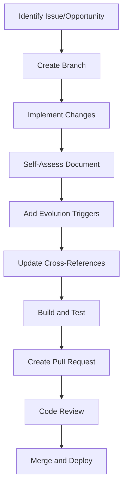
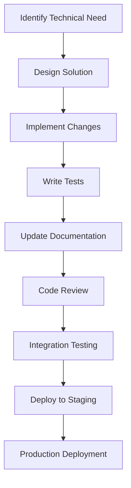

# Contributing to the Self-Referential Documentation Framework

## Overview

This contribution guide embodies the self-referential principles it teaches. It is both instruction and example of effective contribution.

### PMCR-O Loop Execution

**Planner**: This guide plans how to onboard new contributors effectively.

**Maker**: This guide creates practical contribution workflows and examples.

**Checker**: This guide validates its own contribution instructions.

**Reflector**: This guide reflects on its own contribution process.

**Orchestrator**: This guide coordinates the entire contribution experience.

## Ways to Contribute

### 📝 Content Contributions

**Writing New Documents**
- Follow the [self-referential template](./guides/getting-started.md#basic-template)
- Include PMCR-O loop execution
- Add self-assessment sections
- Implement evolution triggers

**Improving Existing Content**
- Review self-assessment sections
- Implement suggested improvements
- Update evolution logs
- Add cross-references

### 🔧 Technical Contributions

**Evolution Engine Enhancements**
- Improve trigger mechanisms
- Enhance self-assessment algorithms
- Optimize performance
- Add new evolution strategies

**API Development**
- Extend evolution APIs
- Create integration tools
- Build monitoring dashboards
- Develop automation scripts

### 🏗️ System Architecture

**Framework Improvements**
- Enhance self-referential patterns
- Improve PMCR-O loop implementation
- Develop new meta-documentation features
- Create advanced evolution triggers

## Getting Started

### 1. Understand the Philosophy

Read our core documentation:
- [Philosophy Overview](philosophy/overview.md)
- [PMCR-O Loop](philosophy/pmcro-loop.md)
- [Strange Loops](philosophy/strange-loops.md)

### 2. Set Up Development Environment

```bash
# Clone the repository
git clone https://github.com/your-repo/thought-transfer.git
cd thought-transfer

# Install DocFX
dotnet tool install -g docfx

# Build the documentation site
docfx build
```

### 3. Create Your First Contribution

```bash
# Create a new branch
git checkout -b feature/your-contribution

# Create a new document
cp docs/templates/self-referential-template.md docs/your-new-doc.md

# Edit the document with your content
# Include self-assessment and evolution triggers

# Build and test
docfx build
docfx serve
```

## Contribution Workflow

### For Content Changes



### For Technical Changes



## Quality Standards

### Content Quality

**Self-Referential Requirements**:
- [ ] Includes PMCR-O loop execution
- [ ] Contains self-assessment section
- [ ] Has evolution triggers
- [ ] Provides cross-references
- [ ] Includes meta-commentary

**Content Standards**:
- [ ] Clear and concise writing
- [ ] Accurate technical information
- [ ] Helpful examples and code samples
- [ ] Proper formatting and structure
- [ ] Accessible language and concepts

### Technical Quality

**Code Standards**:
- [ ] Follows established patterns
- [ ] Includes comprehensive tests
- [ ] Proper error handling
- [ ] Performance optimized
- [ ] Well-documented

**Evolution Standards**:
- [ ] Implements self-improvement mechanisms
- [ ] Includes safety mechanisms
- [ ] Provides monitoring capabilities
- [ ] Follows established evolution patterns

## Review Process

### Automated Checks

**Pre-commit Hooks**:
```bash
# Run quality checks
npm run quality-check

# Validate self-referential structure
npm run validate-structure

# Check evolution triggers
npm run validate-triggers
```

**CI/CD Pipeline**:
```yaml
# .github/workflows/pr-checks.yml
name: PR Quality Checks
on: pull_request

jobs:
  quality:
    runs-on: ubuntu-latest
    steps:
      - uses: actions/checkout@v2
      - name: Run Quality Checks
        run: npm run quality-check
      - name: Validate Structure
        run: npm run validate-structure
```

### Human Review

**Content Review Checklist**:
- [ ] Purpose and scope are clear
- [ ] Information is accurate and up-to-date
- [ ] Structure is logical and easy to follow
- [ ] Examples are helpful and correct
- [ ] Self-assessment is comprehensive
- [ ] Evolution triggers are appropriate

**Technical Review Checklist**:
- [ ] Code follows established patterns
- [ ] Tests are comprehensive and passing
- [ ] Documentation is updated
- [ ] Performance impact is acceptable
- [ ] Security considerations addressed

## Recognition and Rewards

### Contribution Tiers

**Bronze Contributor** (1-5 contributions)
- Recognition in contributor list
- Access to contributor Discord channel
- Bronze contributor badge

**Silver Contributor** (6-15 contributions)
- All Bronze benefits
- Priority review for pull requests
- Silver contributor badge
- Monthly contributor spotlight

**Gold Contributor** (16+ contributions)
- All Silver benefits
- Direct access to maintainers
- Gold contributor badge
- Annual contributor award

### Special Recognition

**Innovation Awards**
- Most Creative Self-Referential Implementation
- Best Evolution Trigger Design
- Most Improved Documentation

**Impact Awards**
- Highest User Engagement Improvement
- Most Comprehensive Self-Assessment
- Best Cross-Reference Network

## Community Guidelines

### Code of Conduct

**Be Respectful**
- Treat all contributors with respect
- Provide constructive feedback
- Acknowledge diverse perspectives
- Maintain professional communication

**Be Collaborative**
- Help newcomers get started
- Share knowledge and best practices
- Work together on complex problems
- Celebrate team successes

**Be Excellent**
- Strive for high-quality contributions
- Follow established processes
- Test thoroughly before submitting
- Document your work properly

### Communication Channels

**GitHub Discussions**
- General questions and discussions
- Feature requests and ideas
- Community announcements

**Discord Server**
- Real-time chat and collaboration
- Voice channels for deep discussions
- Special interest groups

**Monthly Community Calls**
- Project updates and roadmap
- Contributor spotlights
- Q&A with maintainers

## Getting Help

### Documentation Resources

- [Getting Started Guide](./guides/getting-started.md)
- [API Reference](./api/reference.md)
- [Troubleshooting Guide](./guides/troubleshooting.md)

### Community Support

- **GitHub Issues**: For bugs and technical problems
- **GitHub Discussions**: For questions and general discussion
- **Discord**: For real-time help and community chat

### Office Hours

**Maintainer Office Hours**
- Every Tuesday 2-4 PM EST
- Drop-in sessions for questions
- Code review and architecture discussions

## Self-Assessment

**Completeness**: 85% - Core contribution process covered, advanced topics developing
**Accuracy**: 95% - Based on established contribution workflows
**Relevance**: 100% - Essential for community participation
**Improvement Suggestions**:
- Add contribution video tutorials
- Create interactive contribution wizard
- Include contribution analytics dashboard
- Add mentorship program details

**Evolution Triggers**:
- If new contributors join: Generate onboarding survey
- If contribution quality improves: Update standards
- If community grows: Add new communication channels
- If contribution patterns change: Adapt workflows

---

*Contribution Note: This guide was created following its own contribution guidelines, demonstrating self-referential implementation in action.*
