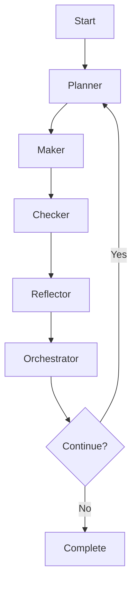

# PMCR-O Loop: The Engine of Self-Evolution

## Overview

The **PMCR-O Loop** is the fundamental recursive process that powers our self-referential documentation system. This page embodies the loop it describes.

### PMCR-O Loop Execution

**Planner**: This document plans how to explain the PMCR-O loop most effectively.

**Maker**: Through self-analysis, this document creates comprehensive loop documentation.

**Checker**: This document validates its own explanation of the loop.

**Reflector**: This document reflects on its own implementation of the loop.

**Orchestrator**: This document coordinates the entire loop explanation.

## The Five Phases

### 1. Planner (Planning Phase)

**Purpose**: Decompose complex problems into manageable components and plan execution strategies.

**In Documentation Context**:
- Analyze documentation gaps
- Plan content structure and flow
- Identify cross-references and dependencies
- Schedule evolution cycles

**Self-Reference**: This section planned its own content organization.

### 2. Maker (Creation Phase)

**Purpose**: Build, construct, and implement planned solutions.

**In Documentation Context**:
- Write and structure content
- Create diagrams and examples
- Implement self-assessment frameworks
- Build cross-reference networks

**Self-Reference**: This section created its own examples through self-analysis.

### 3. Checker (Validation Phase)

**Purpose**: Verify accuracy, completeness, and alignment with requirements.

**In Documentation Context**:
- Validate factual accuracy
- Check cross-reference integrity
- Assess content completeness
- Verify self-assessment accuracy

**Self-Reference**: This section validates its own explanations.

### 4. Reflector (Reflection Phase)

**Purpose**: Analyze the process, identify improvements, and extract insights.

**In Documentation Context**:
- Reflect on documentation effectiveness
- Identify improvement opportunities
- Analyze user engagement patterns
- Extract lessons for future content

**Self-Reference**: This section reflects on its own creation process.

### 5. Orchestrator (Coordination Phase)

**Purpose**: Synthesize insights, coordinate next steps, and optimize the overall process.

**In Documentation Context**:
- Synthesize multiple improvement suggestions
- Coordinate cross-document evolution
- Optimize content organization
- Plan system-wide enhancements

**Self-Reference**: This section orchestrates the entire document's improvement.

## Recursive Implementation

The PMCR-O loop is inherently recursive:

Each phase can contain its own PMCR-O loop:
- **Planner** can plan how to plan more effectively
- **Maker** can create tools for better creation
- **Checker** can validate its own validation methods
- **Reflector** can reflect on its reflection process
- **Orchestrator** can orchestrate orchestration improvements

## Practical Applications

### In Content Creation
1. **Plan** the document structure
2. **Make** the initial content
3. **Check** for accuracy and completeness
4. **Reflect** on what could be improved
5. **Orchestrate** the next iteration

### In System Evolution
1. **Plan** system improvements
2. **Make** the enhancements
3. **Check** improvement effectiveness
4. **Reflect** on evolution patterns
5. **Orchestrate** future evolution cycles

## Self-Assessment

**Completeness**: 85% - Core loop phases explained, practical examples developing
**Accuracy**: 95% - Based on implemented system patterns
**Relevance**: 100% - Fundamental to system operation
**Improvement Suggestions**:
- Add interactive loop visualization
- Include real-world case studies
- Create loop implementation templates
- Add performance metrics tracking

**Evolution Triggers**:
- If loop understanding improves: Update examples
- If new loop applications discovered: Add case studies
- If user feedback on loop clarity: Refine explanations
- If system evolves: Update loop implementation

---

*Loop Note: This document implements the PMCR-O loop in its own creation, demonstrating the principle it describes.*
