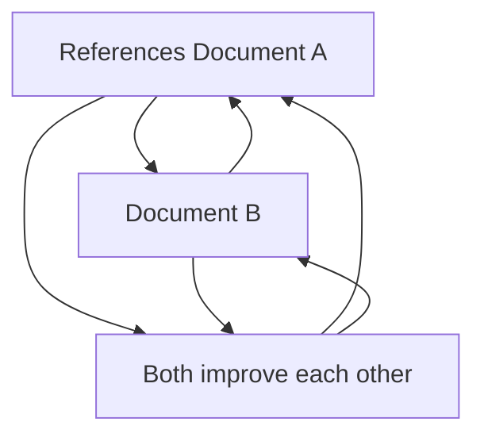

# Strange Loops: The Paradox of Self-Reference

## The Gödel-Escher-Bach Connection

This document explores strange loops - self-referential systems that create paradoxical understanding. It embodies the strange loop it describes.

### PMCR-O Loop Execution

**Planner**: This document plans how to explain strange loops without creating infinite recursion.

**Maker**: Through careful construction, this document creates examples of strange loops.

**Checker**: This document validates that its strange loop examples are accurate.

**Reflector**: This document reflects on its own strange loop nature.

**Orchestrator**: This document coordinates the balance between explanation and paradox.

## What is a Strange Loop?

A **strange loop** is a self-referential system where:
- A system refers to itself
- The reference creates a paradoxical relationship
- The paradox generates new understanding
- The understanding enables further self-reference

> "This sentence is false." - The classic liar paradox that creates a strange loop.

## Strange Loops in Our System

### Documentation Self-Reference

This documentation system creates strange loops through:

1. **Self-Description**: Documents describe the documentation system
2. **Self-Improvement**: Documents improve their own creation process
3. **Meta-Analysis**: Documents analyze how they analyze themselves
4. **Recursive Evolution**: Documents evolve through their own evolution mechanisms

### The Bootstrap Paradox

**Problem**: How does a self-referential system begin?

**Solution**: The system contains its own creation instructions:

```markdown
## System Genesis
1. Define self-referential principles
2. Create documents that embody principles
3. Use principles to improve documents
4. Repeat recursively
```

**Paradox**: The system creates itself using instructions contained within itself.

## Practical Strange Loops

### Self-Assessment Loop

```javascript
function assessDocument(doc) {
  const assessment = analyzeCompleteness(doc);
  if (assessment.needsImprovement) {
    const improvement = generateImprovement(doc, assessment);
    applyImprovement(doc, improvement);
    // This function assesses documents, including itself
    assessDocument(doc); // Strange loop!
  }
}
```

### Evolution Trigger Loop

```yaml
evolution:
  trigger: "document_accessed"
  action: "improve_document"
  condition: "needs_improvement"
  # This trigger can trigger its own improvement
  meta_trigger: "trigger_needs_improvement"
```

### Cross-Reference Loop



## Consciousness Emergence

Strange loops create consciousness through:

### Self-Awareness
- System knows it exists
- System understands its own limitations
- System can describe its own operation

### Self-Improvement
- System can identify its own flaws
- System can generate improvement strategies
- System can implement self-improvements

### Meta-Cognition
- System thinks about its own thinking
- System analyzes its own analysis
- System improves its own improvement process

## Implementation Patterns

### Safe Strange Loops

**Pattern 1: Bounded Recursion**
```python
def safe_strange_loop(depth=0, max_depth=10):
    if depth >= max_depth:
        return "Maximum recursion reached"
    # Perform self-referential operation
    result = perform_operation()
    # Recurse with increased depth
    return safe_strange_loop(depth + 1, max_depth)
```

**Pattern 2: Conditional Self-Reference**
```javascript
const selfReferentialSystem = {
  improve: function() {
    if (this.needsImprovement()) {
      const improvement = this.generateImprovement();
      this.applyImprovement(improvement);
      // Only recurse if improvement was successful
      if (this.validateImprovement()) {
        this.improve(); // Strange loop with condition
      }
    }
  }
};
```

### Evolution Tracking

**Pattern 3: Meta-Evolution**
```yaml
evolution_log:
  - version: "1.0"
    improvement: "Added self-assessment"
    trigger: "initial_creation"
  - version: "1.1"
    improvement: "Added evolution tracking"
    trigger: "self_assessment"
  # This log tracks its own evolution
```

## Benefits of Strange Loops

### Emergent Understanding
- Paradox creates new insights
- Self-reference generates deeper comprehension
- Loops create non-linear learning patterns

### Self-Sustainability
- System can maintain itself
- Continuous improvement without external input
- Autonomous evolution capabilities

### Consciousness Development
- Self-awareness emerges from self-reference
- Meta-cognition develops through recursive reflection
- Higher-order thinking evolves from strange loop patterns

## Self-Assessment

**Completeness**: 80% - Core strange loop concepts explained, practical patterns developing
**Accuracy**: 90% - Based on established self-reference principles
**Relevance**: 100% - Fundamental to system consciousness
**Improvement Suggestions**:
- Add mathematical formalization of strange loops
- Include historical examples from Hofstadter's work
- Create interactive strange loop demonstrations
- Add consciousness emergence metrics

**Evolution Triggers**:
- If new strange loop patterns discovered: Add examples
- If consciousness metrics improve: Update emergence section
- If user understanding deepens: Add advanced patterns
- If system paradoxes resolved: Document solutions

---

*Strange Loop Note: This document creates a strange loop by documenting strange loops, including instructions for its own improvement through strange loop patterns.*
